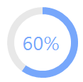
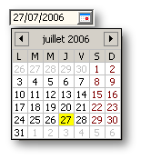

# Nebula Project | The Eclipse Foundation

  

## Supplemental Custom Widgets

Nebula is a place where different Eclipse-Projects and independent developers collaborate on building custom SWT widgets and UI-Components for applications built using SWT and JFace.

All available Nebula components are listed below.
Each image links to a page that will further describe the component and its function.

### Nebula Released Widgets:

  
[CDateTime](https://eclipse.dev/nebula/widgets/cdatetime/cdatetime.html)

  
[PShelf](https://eclipse.dev/nebula/widgets/pshelf/pshelf.html)

  
[GanttChart](https://eclipse.dev/nebula/widgets/ganttchart/ganttchart.html)

  
[Gallery](https://eclipse.dev/nebula/widgets/gallery/gallery.html)

  
[Grid](https://eclipse.dev/nebula/widgets/grid/grid.html)

  
[PaperClips](https://eclipse.dev/nebula/widgets/paperclips/paperclips.html)

  
[Oscilloscope](https://eclipse.dev/nebula/widgets/oscilloscope/oscilloscope.html)

  
[PGroup](https://eclipse.dev/nebula/widgets/pgroup/pgroup.html)

  
[RichText](https://eclipse.dev/nebula/widgets/richtext/richtext.html)

  
[GeoMap](https://eclipse.dev/nebula/widgets/geomap/geomap.html)

  
[TableCombo](https://eclipse.dev/nebula/widgets/tablecombo/tablecombo.html)

  
[XViewer](https://eclipse.dev/nebula/widgets/xviewer/xviewer.html)

  
[STW - SWT Transition Widget](https://eclipse.dev/nebula/widgets/stw/stw.html)

  
[Breadcrumb](https://wiki.eclipse.org/Nebula_Breadcrumb)

  
[CheckboxGroup](https://wiki.eclipse.org/Nebula_CheckboxGroup)

  
[ColumnBrowser](https://wiki.eclipse.org/Nebula_ColumnBrowser)

  
[Dialog](https://wiki.eclipse.org/Nebula_Dialog)

  
[DualList](https://wiki.eclipse.org/Nebula_Duallist)

  
[Header](https://wiki.eclipse.org/Nebula_Header)

  
[HeapManager](https://wiki.eclipse.org/Nebula_HeapManager)

  
[LoginDialog](https://wiki.eclipse.org/Nebula_LoginDialog)

  
[Multichoice](https://wiki.eclipse.org/Nebula_Multichoice)

  
[Notifier](https://wiki.eclipse.org/Nebula_Notifier)

  
[PreferenceWindow](https://wiki.eclipse.org/Nebula_PreferenceWindow)

  
[PromptSupport](https://wiki.eclipse.org/Nebula_PromptSupport)

  
[PreferenceWindow](https://wiki.eclipse.org/Nebula_PropertyTable)

  
[RangeSlider](https://wiki.eclipse.org/Nebula_RangeSlider)

  
[RoundedToolbar](https://wiki.eclipse.org/Nebula_RoundedToolbar)

  
[StarRating](https://wiki.eclipse.org/Nebula_StarRating)

  
[TextAssist](https://wiki.eclipse.org/Nebula_TextAssist)

  
[Tip of the day](https://wiki.eclipse.org/Nebula_TipOfTheDay)

  
[TitledSeparator](https://wiki.eclipse.org/Nebula_TitledSeparator)

  
[Calculator](https://wiki.eclipse.org/Nebula_Calculator)

  
[Horizontal Spinner](https://wiki.eclipse.org/Nebula_HorizontalSpinner)

  
[Launcher](https://wiki.eclipse.org/Nebula_Launcher)

  
[Panels](https://wiki.eclipse.org/Nebula_Panels)

  
[Switch Button](https://wiki.eclipse.org/Nebula_SwitchButton)

  
[ProgressCircle](https://wiki.eclipse.org/Nebula_ProgressCircle)

  
[NebulaSlider](https://wiki.eclipse.org/Nebula_NebulaSlider)

  
[NebulaSplitButton](https://wiki.eclipse.org/Nebula_NebulaSplitButton)

  
[NebulaRoundedCheckbox](https://wiki.eclipse.org/Nebula_NebulaRoundedCheckBox)

  
[FloatingText](https://wiki.eclipse.org/Nebula/FloatingText)

  
[Password Revealer](https://wiki.eclipse.org/Nebula_PasswordRevealer)

  
[CTreeCombo](https://wiki.eclipse.org/Nebula_CTreeCombo)

  
[Badged Label](https://wiki.eclipse.org/Nebula_Badged_Label)

  
[LED Display](https://wiki.eclipse.org/Nebula_LED)

  
[Step bar](https://wiki.eclipse.org/Nebula_Stepbar)

  
[Chips](https://wiki.eclipse.org/Nebula_Chips)

  
[Carousel](https://wiki.eclipse.org/Nebula_Carousel)

  
[Nebula Font Awesome](https://wiki.eclipse.org/Nebula_FontAwesome)

  
[Rounded Switch](https://wiki.eclipse.org/Nebula_RoundedSwitch)

  
[SegmentedBar](https://wiki.eclipse.org/Nebula_SegmentedBar)

  
[Tiles](https://wiki.eclipse.org/Nebula_Tiles)

  
[TreeMapper](https://eclipse.dev/nebula/widgets/treemapper/treemapper.html)

### NatTable :

  
[NatTable](https://www.eclipse.org/nattable/)

### Visualization :

  
[Visualization](https://eclipse.dev/nebula/widgets/visualization/visualization.html)

### Nebula Incubation Widgets :

  
[CollapsibleButtons](https://eclipse.dev/nebula/widgets/collapsiblebuttons/collapsiblebuttons.html)

  
[CompositeTable](https://eclipse.dev/nebula/widgets/compositetable/compositetable.html)

  
[DateChooser](https://eclipse.dev/nebula/widgets/datechooser/datechooser.html)

  
[DateChooserCombo](https://eclipse.dev/nebula/widgets/datechooser/datechooser.html)

  
[FormattedText](https://eclipse.dev/nebula/widgets/formattedtext/formattedtext.html)

  
[RadioGroup](https://eclipse.dev/nebula/widgets/radiogroup/radiogroup.html)

  
[Picture](https://eclipse.dev/nebula/widgets/picture/picture.html)

  
[Pagination](https://eclipse.dev/nebula/widgets/pagination/pagination.html)

  
[Timeline](https://eclipse.dev/nebula/widgets/timeline/timeline.html)
